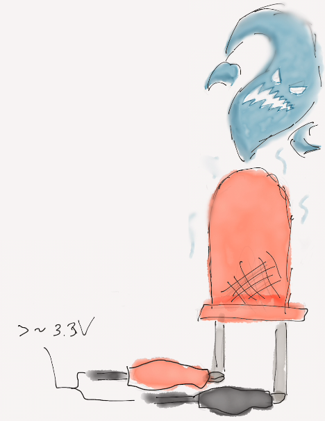

# Voltage

So if you're new to electricity in general, you've probably seen a sign like this:

Or you've heard that song by Electric Six. So you might be a little wary of messing with electronics because they're dangerous.

Well, just like almost everything else on the planet, when handled with care and a little bit of knowledge, it's perfectly safe! We wouldn't be making kits for kids to build bots with if it were that unsafe, right?

So I could just tell you "The voltage most of the boards and peripherals we use is so small that there's almost no chance they'll harm you if you don't abuse them or bathe in them." But let's not just take my word for it and dig a little deeper: let's talk about what Voltage is and when it comes into play when you're working on robotics projects.

### What is Voltage?

Voltage is _the amount of potential energy released when an electric charge moves from a place with higher potential to a point of lower potential._ 

_..._what? That's a bit much. Let's use an analogy to simplify it: Voltage is the "power level" of the electric charge \(not in the technical definition, don't @ me\). Think of it in terms of a small firecracker to an explosive for a large fireworks display-- the small fire cracker puts out a small BANG! and maybe some light, and the firework puts out a TON of noise and sound. This is similar to Voltage: a higher voltage is needed to power larger devices, while devices like a smartphone display operate in the 3-5 Volt range.

### What do I need to know about Voltage?

The main thing to keep in mind about voltage when working with microcontrollers and peripherals is their **operating voltage.** This range is the range in which the device will operate properly. For example, the Tessel 2 micrcontroller has less of an operating range and more of an operating voltage, which is the 5V it recieves when you plug in the USB cable to the Tessel 2 board and a powered USB port. ****By comparison, the Arduino Uno has a barrel jack port that can take anywhere from 5 to 18V. Peripherals, such as LEDs and sensor, also have operating voltage ranges-- usually either 3.3V, 5V, or a range contaning 3.3-5V. **Always look at the operating voltage of a device before giving it power.**

### **What happens when I supply too much/little voltage?**

Too little voltage can cause erratic behavior or a lack of booting at all for most microcontrollers and peripherals. Too much voltage will heat up and eventually fry your device, emitting a nasty-smelling smoke and being rendered unusable \(some call this an attack of the 'blue smoke monster'\)

### Will I ever go above 5 volts?

Rarely, and only to power external devices, like household electronics or strong lights that require higher voltage. **Do not connect these devices directly to your microcontroller, as this will most certainly end badly, if not dangerously.** Instead, you will use a relay to connect the wires of the device to each other, and a set of pins to control a switch that operate in the 3.3 to 5V range that your micrcontroller uses. However, **always unplug household electronics that use an outlet before doing anything with the wires, and always check the input voltage range of the relay!** We will go into relays in another zine, but there are also awesome tutorials at:

* [SparkFun](https://www.sparkfun.com/tutorials/119)
* [Adafruit](https://learn.adafruit.com/experimenters-guide-for-metro/circ11-intro)

